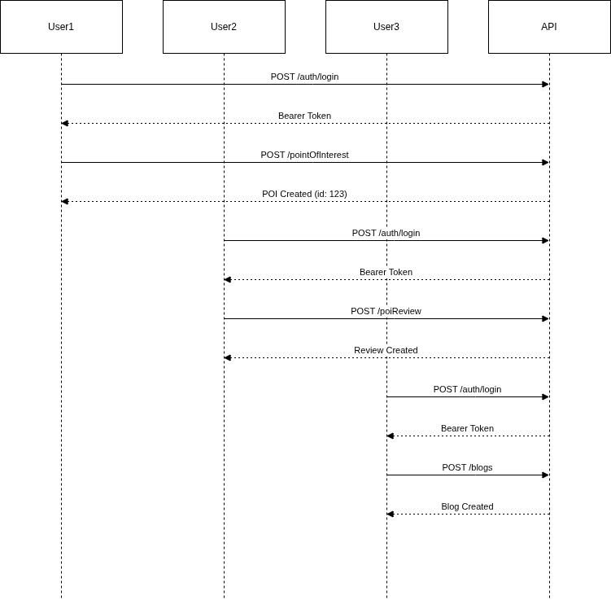

# Workflow de Fonctionnement de l'API POI

Ce document a pour objectif de faciliter la compréhension fonctionnelle de ton API et de définir des scénarios de bout en bout pour l’intégration côté client (mobile ou web).

## 🧩 1. Concepts Métier

Avant d’entrer dans les workflows, voici les principaux objets métier :

### 🔹 Organisation

Représente la racine du système.

Toutes les autres entités (User, POI, Blogs, etc.) sont liées à une organisation.

Sert pour la gestion multi-tenant ou segmentation de l’accès.

### 🔹 User (Utilisateur)

Appartient à une organisation.

Doit s’authentifier pour accéder aux opérations protégées.

Peut créer des POI, des avis (reviews), des blogs, des podcasts.

### 🔹 PointOfInterest (POI)

Représente un lieu ou point d’intérêt unique.

Contient des informations géographiques et descriptives (ex : nom, description, coordonnées).

### 🔹 PoiReview (Avis)

Avis qu’un utilisateur authentifié poste pour un POI.

Permet de qualifier/évaluer un POI (notation, commentaire, etc.).

### 🔹 PoiPlatformStat (Statistiques)

Fournit des statistiques agrégées relatives aux POI (par exemple : nombre de visites, nombre d’avis, notes moyennes).

### 🔹 Blogs

Un utilisateur peut écrire un article lié à un POI spécifique, permettant de publier du contenu enrichi (texte, images).

### 🔹 Podcasts

Un utilisateur peut créer un podcast associé à un POI spécifique (contenu audio).

## 🔑 2. Authentification & Sécurité

Login / Auth

Endpoints : /auth/login, /auth/token (ou équivalent)

Retourne un JWT / Bearer token.

Ce token est utilisé dans l’en-tête Authorization pour les appels protégés.

📌 Tous les workflows ci-dessous supposent un token valide.

## 🚀 3. Workflows Métier
### 🔹 Workflow A : Inscription & Authentification

Objectif : Permettre à un utilisateur de s’inscrire, de s’authentifier et d’obtenir un token.

Créer une organisation

POST /organizations

Body : { name, description, ... }

⚙️ Retour : Organisation créée.

Créer un user dans l’organisation

POST /users

Body : { organizationId, email, password, nom, ... }

⚙️ Retour : User créé.

Authentifier l’utilisateur

POST /auth/login

Body : { email, password }

⚙️ Retour : JWT Bearer token.

👉 Le token doit être utilisé pour toutes les opérations nécessitant une authentification.

### 🔹 Workflow B : Gestion & Création de POI

Objectif : Permettre à un user authentifié de créer, lire, modifier et supprimer un POI.

Lister les POI

GET /pointOfInterest

⚙️ Retour : Liste des POIs pour l’organisation.

Créer un POI

POST /pointOfInterest

Headers : Authorization: Bearer <token>

Body : { name, description, latitude, longitude, tags, ... }

⚙️ Retour : POI créé.

Modifier un POI

PUT /pointOfInterest/{id}

Body : champs à mettre à jour.

Supprimer un POI

DELETE /pointOfInterest/{id}

👉 L’utilisateur authentifié doit avoir les droits nécessaires (CRUD) sur les POIs.

### 🔹 Workflow C : Poster un Avis (Review)

Objectif : Un utilisateur ajoute un avis à un POI.

Créer un avis

POST /poiReview

Headers : Authorization: Bearer <token>

Body : { poiId, rating, comment }

⚙️ Retour : Avis créé.

Lister les avis d’un POI

GET /poiReview?poiId={poiId}

Supprimer un avis

DELETE /poiReview/{id} (si droit autorisé)

### 🔹 Workflow D : Statistiques POI (PoiPlatformStat)

Objectif : Obtenir des statistiques relatives à un ou plusieurs POIs.

Récupérer statistiques

GET /poiPlatformStat

Query : { poiId, fromDate, toDate }

⚙️ Retour : Données agrégées (ex : nombre de reviews, note moyenne, vues…).

### 🔹 Workflow E : Blogs liés aux POI

Objectif : Créer et gérer des blogs dédiés à un POI.

Lister les blogs d’un POI

GET /blogs?poiId={poiId}

Créer un blog

POST /blogs

Headers : Authorization: Bearer <token>

Body : { poiId, title, content, tags }

⚙️ Retour : Blog créé.

Modifier / Supprimer un blog

PUT /blogs/{id}, DELETE /blogs/{id}

### 🔹 Workflow F : Podcasts liés aux POI

Objectif : Ajouter un podcast pour un POI.

Lister les podcasts

GET /podcasts?poiId={poiId}

Créer un podcast

POST /podcasts

Headers : Authorization: Bearer <token>

Body : { poiId, title, audioUrl, description, ... }

⚙️ Retour : Podcast créé.

Modifier / Supprimer un podcast

PUT /podcasts/{id}, DELETE /podcasts/{id}


## 📊 4. Séquences d’Interaction



# 📚 Annexe : Documentation de l'API

Cette documentation détaille les endpoints, les formats de données JSON et les méthodes d'authentification requis pour l'application.

---

## 🔍 Authentification

### `POST /auth/login`
> **Description** : Authentifie un utilisateur et retourne un token JWT.

**Exemple de requête**
```http
POST /auth/login
Content-Type: application/json

{
  "email": "user@example.com",
  "password": "password123"
}
```

**Réponse attendue**
```json
{
  "token": "eyJhbGciOi..."
}
```

---

# 🛠️ Partie 1 : Workflow de Fonctionnement

Ce document a pour objectif de faciliter la compréhension fonctionnelle de l’API et de définir des scénarios de bout en bout pour l’intégration côté client (mobile ou web).

## 🧩 1. Concepts Métier

Avant d’entrer dans les workflows, voici les principaux objets métier :

### 🔹 Organisation
Représente la racine du système. Toutes les autres entités (User, POI, Blogs, etc.) sont liées à une organisation. Sert pour la gestion multi-tenant ou segmentation de l’accès.

### 🔹 User (Utilisateur)
Appartient à une organisation. Doit s’authentifier pour accéder aux opérations protégées. Peut créer des POI, des avis (reviews), des blogs, des podcasts.

### 🔹 PointOfInterest (POI)
Représente un lieu ou point d’intérêt unique. Contient des informations géographiques et descriptives (ex : `poi_name`, `latitude`, `longitude`, `poi_category`).

### 🔹 PoiReview (Avis)
Avis qu’un utilisateur authentifié poste pour un POI. Permet de qualifier/évaluer un POI (notation, commentaire).

### 🔹 PoiPlatformStat (Statistiques)
Fournit des statistiques agrégées relatives aux POI (par exemple : nombre de visites, nombre d’avis, notes moyennes).

### 🔹 Blogs & Podcasts
Contenu enrichi (articles ou audio) associé à un POI spécifique.

---

## 🔑 2. Authentification & Sécurité

**Login / Auth**
* **Endpoint** : `/auth/login` (Standard)
* **Retour** : Token JWT (Bearer).
* **Utilisation** : Ce token doit être inclus dans l’en-tête `Authorization` pour les appels protégés.

> 📌 **Note** : Tous les workflows ci-dessous supposent que vous possédez un token valide.

---

## 🚀 3. Workflows Métier & Endpoints

### 🔹 Workflow A : Inscription & Authentification

**Objectif** : Permettre à un utilisateur de s’inscrire, de s’authentifier et d’obtenir un token.

#### 1. Créer une organisation
```http
POST /api/organizations
Content-Type: application/json

{
  "organizationName": "Ma Super Organisation",
  "orgType": "MERCHANT",
  "orgCode": "ORG001"
}
```

#### 2. Créer un utilisateur dans l’organisation
```http
POST /api/users
Content-Type: application/json

{
  "organizationId": "uuid-org-...",
  "email": "user@example.com",
  "password": "Password123!",
  "username": "john_doe",
  "role": "USER"
}
```

#### 3. Authentifier l’utilisateur
```http
POST /auth/login
Content-Type: application/json

{
  "email": "user@example.com",
  "password": "Password123!"
}
```
👉 *Retourne le Token Bearer à utiliser pour la suite.*

---

### 🔹 Workflow B : Gestion & Création de POI

**Objectif** : Permettre à un user authentifié de gérer les Points d'Intérêt.

#### 1. Lister les POI
```http
GET /api/pois
Authorization: Bearer <TOKEN>
```

#### 2. Créer un POI
*Note : Les champs respectent le `PointOfInterestDTO`.*
```http
POST /api/pois
Authorization: Bearer <TOKEN>
Content-Type: application/json

{
  "organization_id": "uuid-org...",
  "poi_name": "Hôtel Le Bonanjo",
  "poi_type": "HOTEL",
  "poi_category": "ACCOMMODATION",
  "latitude": 4.051,
  "longitude": 9.712,
  "poi_description": "Hôtel 5 étoiles au centre ville",
  "address_city": "Douala"
}
```

#### 3. Modifier un POI
```http
PUT /api/pois/{poi_id}
```

#### 4. Supprimer un POI
```http
DELETE /api/pois/{poi_id}
```

---

### 🔹 Workflow C : Poster un Avis (Review)

**Objectif** : Un utilisateur ajoute un avis à un POI.

#### 1. Créer un avis
```http
POST /api-reviews
Authorization: Bearer <TOKEN>
Content-Type: application/json

{
  "poiId": "uuid-poi...",
  "rating": 5,
  "reviewText": "Excellent service !"
}
```

#### 2. Lister les avis d’un POI
```http
GET /api-reviews/poi/{poi_id}/reviews
```

#### 3. Statistiques des avis d'un POI
```http
GET /api-reviews/poi/{poi_id}/stats
```

---

### 🔹 Workflow D : Statistiques & Popularité

**Objectif** : Obtenir des données sur les POIs.

#### 1. POIs les plus populaires
```http
GET /api/pois/popular
```

#### 2. Statistiques globales (Reviews)
```http
GET /api-reviews/poi/{poi_id}/stats
```

---

### 🔹 Workflow E : Blogs liés aux POI

**Objectif** : Créer et gérer des blogs dédiés à un POI.

#### 1. Créer un blog
```http
POST /api/blogs
Authorization: Bearer <TOKEN>
Content-Type: application/json

{
  "poi_id": "uuid-poi...",
  "title": "Visite guidée",
  "content": "Détail de la visite...",
  "cover_image_url": "http://image..."
}
```

#### 2. Lister les blogs d’un POI
```http
GET /api/blogs/poi/{poi_id}
```

---

### 🔹 Workflow F : Podcasts liés aux POI

**Objectif** : Ajouter un podcast pour un POI.

#### 1. Créer un podcast
```http
POST /api/podcasts
Authorization: Bearer <TOKEN>
Content-Type: application/json

{
  "poi_id": "uuid-poi...",
  "title": "Histoire du lieu",
  "audio_file_url": "https://server/audio.mp3",
  "description": "Podcast audio",
  "duration_seconds": 300
}
```

#### 2. Lister les podcasts d’un POI
```http
GET /api/podcasts/poi/{poi_id}
```

---

# 📚 Partie 2 : Référence Technique (Swagger Extract)

## 📍 Points of Interest API (`/api/pois`)

| Méthode | Endpoint | Description |
| :--- | :--- | :--- |
| **GET** | `/api/pois` | Récupérer tous les POIs |
| **POST** | `/api/pois` | Créer un nouveau POI |
| **GET** | `/api/pois/{poi_id}` | Récupérer un POI par ID |
| **GET** | `/api/pois/search` | Rechercher par localisation (`/location`) ou nom (`/name`) |
| **GET** | `/api/pois/category/{category}` | Filtrer par catégorie |

### Schéma clé : `PointOfInterestDTO`
* `poi_name` (string)
* `poi_type` (Enum: RESTAURANT, HOTEL, MUSEE, etc.)
* `poi_category` (Enum: FOOD_DRINK, ACCOMMODATION, LEISURE_CULTURE...)
* `town_id` (uuid)
* `latitude` / `longitude` (double)

---

## 🏢 Organization API (`/api/organizations`)

| Méthode | Endpoint | Description |
| :--- | :--- | :--- |
| **POST** | `/api/organizations` | Créer une organisation |
| **GET** | `/api/organizations/{id}` | Détail d'une organisation |
| **GET** | `/api/organizations/by-code/{org_code}` | Recherche par code |

### Schéma clé : `OrganizationDTO`
* `organizationName`
* `orgCode`
* `orgType` (Enum: MERCHANT, DISTRIBUTOR...)

---

## ⭐ Reviews API (`/api-reviews`)

| Méthode | Endpoint | Description |
| :--- | :--- | :--- |
| **POST** | `/api-reviews` | Créer une review |
| **GET** | `/api-reviews/poi/{poi_id}/reviews` | Liste des reviews d'un POI |
| **GET** | `/api-reviews/poi/{poi_id}/average-rating` | Note moyenne |
| **PATCH** | `/api-reviews/{review_id}/like` | Liker un avis |

---

## 📝 Blogs & 🎙️ Podcasts API

* **Blogs** : `/api/blogs`, `/api/blogs/poi/{poi_id}`
* **Podcasts** : `/api/podcasts`, `/api/podcasts/poi/{poi_id}`

---